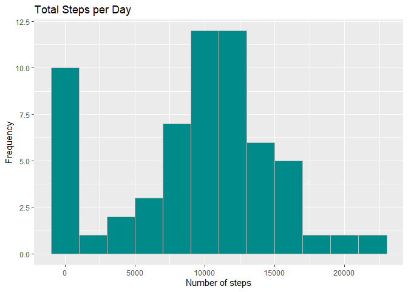
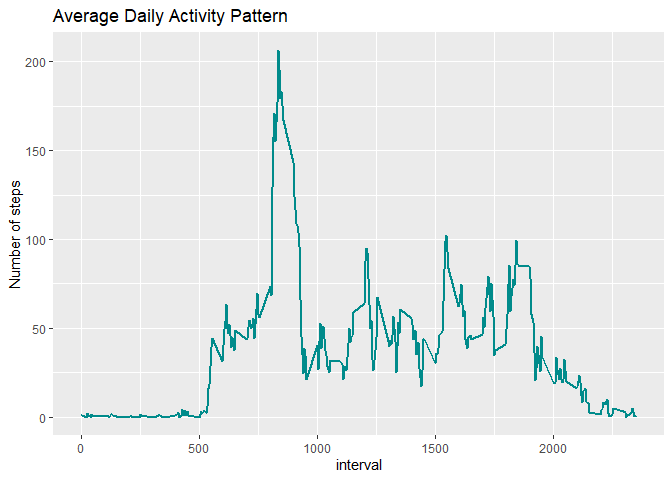
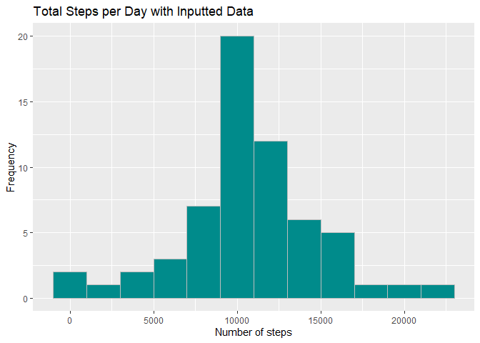
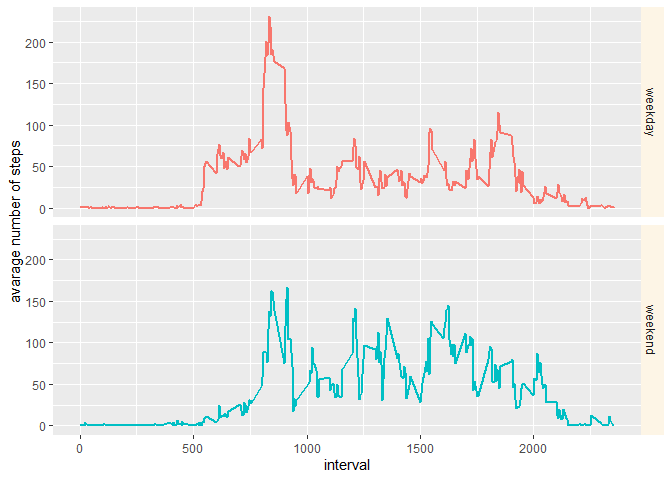

```r
options(scipen=99999)
```


```
## 
## Attaching package: 'dplyr'
```

```
## The following objects are masked from 'package:stats':
## 
##     filter, lag
```

```
## The following objects are masked from 'package:base':
## 
##     intersect, setdiff, setequal, union
```

## Loading and preprocessing the data

```r
            activity  <- read.csv("activity.csv")
       activity$date  <- as.Date(activity$date)
activity$interval.fac <- as.factor(activity$interval)

dates <- as.character(activity$date)
times <- sprintf("%04d", activity$interval)
activity$date.time <- strptime(paste(dates, times), "%Y-%m-%d %H%M")
```


```r
totalStepsPerDay <- tapply(activity$steps, activity$date, sum, na.rm=TRUE)
totalStepsPerDay.df <- as.data.frame(totalStepsPerDay)
```


```r
ggplot(data=totalStepsPerDay.df,aes(x=totalStepsPerDay), na.rm=TRUE) + 
    geom_histogram(col="gray", fill="darkcyan", binwidth = 2000) + 
    labs(title = "Total Steps per Day") + 
    labs(x="Number of steps", y="Frequency") 
```

<!-- -->


## What is mean total number of steps taken per day?

```r
mean(totalStepsPerDay)
```

```
## [1] 9354.23
```

```r
median(totalStepsPerDay)
```

```
## [1] 10395
```
Mean total number of steps taken per day, with missing(NAs) data is **9354.2295082**


## What is the average daily activity pattern?

```r
meanStepsPerInterval <- aggregate(x = list(steps = activity$steps), 
                      by = list(interval = activity$interval), 
                      mean, na.rm = TRUE)
```


```r
ggplot(meanStepsPerInterval, aes(x = interval, y = steps)) + 
    geom_line(size=0.71,colour = "darkcyan") + 
    labs(x = "interval", 
         y = "Number of steps", 
         title = "Average Daily Activity Pattern") 
```

<!-- -->

## Which 5-minute interval, on average across all the days in the dataset, contains the maximum number of steps?

```r
max(meanStepsPerInterval$steps)
```

```
## [1] 206.1698
```

```r
activity$interval[which.max(meanStepsPerInterval$steps)]
```

```
## [1] 835
```
On average across all days, the maximum number of steps is **206.1698** occured at interval **835**

## Inputing missing values

```r
missingData <- is.na(activity$steps)
sum(missingData)
```

```
## [1] 2304
```

```r
table(missingData)
```

```
## missingData
## FALSE  TRUE 
## 15264  2304
```
There are a total of **2304** of records with missing data

Strategy to populate intervals with missing data is to take the mean for that day and round it up to the next integer value.


```r
activity$interval_revised <- times
byInterval <- split(activity, activity$interval_revised) 
activity$average_steps <- sapply(byInterval, function(x) mean(x$steps, na.rm = TRUE))
activity$steps_revised <-  ifelse(is.na(activity$steps)
                                      , ceiling(activity$average_steps)
                                      , activity$steps)

activityFilled <- data.frame(steps=activity$steps_revised,
                             date = activity$date,
                             interval = activity$interval)
totalFilledSteps <- tapply(activityFilled$steps, activityFilled$date, sum, na.rm=TRUE)
totalFilledSteps.df <- as.data.frame(totalFilledSteps)
```


```r
ggplot(data=totalFilledSteps.df,aes(x=totalFilledSteps), na.rm=TRUE) + 
    geom_histogram(col="gray", fill="darkcyan", binwidth = 2000) + 
    labs(title = "Total Steps per Day with Inputted Data") + 
    labs(x="Number of steps", y="Frequency") 
```

<!-- -->


```r
mean(totalFilledSteps)
```

```
## [1] 10784.92
```

```r
median(totalFilledSteps)
```

```
## [1] 10909
```
After inputting the dataset with some values for the missing (NAs) data, the mean and median values have increased as expected. The mean increased from **9,354.23** to **10,784.92** and median increased from **10,395** to **10,909**

## Are there differences in activity patterns between weekdays and weekends?

```r
isWeekend <- c(0, 6)
activityFilled$dayType <-  ifelse(as.POSIXlt(activityFilled$date)$wday %in% isWeekend, 'weekend', 'weekday')
activityFilledMean <- aggregate(steps ~ interval + dayType, data=activityFilled, mean)
```


```r
ggplot(activityFilledMean, aes(interval, steps, color=factor(dayType))) + 
    geom_line(size=0.72) + 
    facet_grid(dayType ~ .) +
    xlab("interval") + 
    ylab("avarage number of steps") +
    theme(strip.background = element_rect(fill="oldlace"), legend.position = "none") +
    guides(fill="none")
```

<!-- -->

The data shows that during the week, most steps are taken in the morning and evening, perhaps during commute to and from work.
While the weekend activity pattern shows that the individual is most active at midday.

